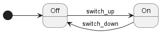
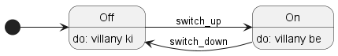

# Villanykapcsoló modellezés példa

A legegyszerűbb eszköz mindennapjainkban amit állapotgéppel lehet modellezni a villanykapcsoló.

Egyértelmű, hogy a villanykapcsolónak mind megfigyeléseink, mind működés szempontjából két állapota van: vagy be van kapcsolva és világít, vagy nincs és nem ad fényt. 
A két állapot között váltogathatunk, ha a kapcsolót felfelé (kikapcsolt állapotból bekapcsoljuk) vagy lefelé kapcsoljuk (bekapcsolt állapotból kikapcsoljuk).

Összegezve, az állapotgép fő alkotóelemei az állapotok, amelyek a rendszer egy diszkrét viselkedését írják le. A villanykapcsoló esetében a következő két állapotot kell számontartanunk:
- Bekapcsolva: a lámpa világít
- Kikapcsolva: lámpa nem világít

Az állapotgépek másik fő alkotóeleme az állapotátmenetek. A következő átmenetek definiálhatóak a villanykapcsoló esetében:
- Kikapcsolva --> Bekapcsolva: a lámpát felkapcsoljuk
- Bekapcsolva --> Kikapcsolva: a lámpát kikapcsoljuk

Ezek alapján már összerakható az UML állapotgépdiagramja a rendszernek.

_Kiegészítés_: az UML megengedi, hogy az állapotokban a metódusok (~függvények) végrehajtását jelöljük. Ezek a következőek:
- __do__: az állaptoban ennek a cselekménynek a folytonos végrehajtása történik
- __enter__: az állapotba belépés során ez a függvény hívódik meg
- __exit__: az állapotból kilépés során ez a cselekmény hívódik meg

Állapotátmenetekhez is rendelhető cselekmények végrehajtása. Felmerül a kérdés, hogy esetünkben mikor történik egy cselekedetnek a végrehajtása, vagyis a lámpa ki/be kapcsolása?

Végiggondolva a lámpa esetében akkor fog világítani a lámpabúra, amikor egy adott állapotban benne vagyunk, nem az állapotátmenetkor. Gondoljunk bele: ha a kapcsolót állítjuk az nem feltétlenül jelenti a lámpabúra világítását.
A lámpatest akkor fog világítani, amikor ténylegesen bekerültünk egy állapotba. Ez ebben az esetben nem is annyira szembetűnő, de belegondolva, felvehetünk új állapotokat is, vagy további vezérléseket, ami komplexebbé tehetné a rendszert (pl. kényelmi világítás, hideg/meleg fény, stb.)
Ezekkel az információkkal bővíthető az állapotgépünk:

_Érdekesség_: Németországban az állapotátmenetek fordított irányúak lennének.
