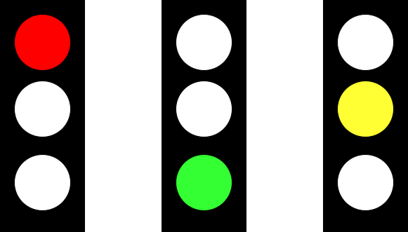
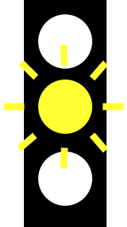
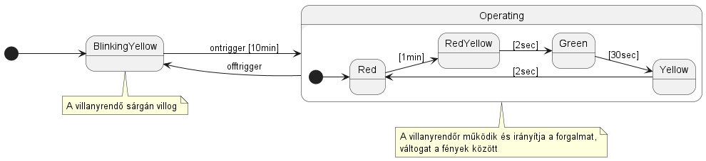

# Villanyrendőr állapotgép modellezés példa

Általánosan elterjedt bemutató példa rendszerek állapotgép-alapú modellezésénél a villanyrendőr viselkedésmodellje.
Minden ehhez hasonló feladatot az állapotok azonosításával célszerű elkezdeni. A legegyszerűbb megközelítésben is látszik, hogy egy villanyrendőrnek 3 állapota biztosan van (ld. ábra):
- __Piros__: a lámpa pirosan világít, ebből az irányból tilos áthaladni
- __Zöld__: a lámpa zölden világít, áthaladás ebből az irányból megengedett
- __Sárga__: a lámpa sárgán világít, hamarosan átvált a lámpa pirosra

Mi a helyzet a következő esettel, amikor egyszerre piros és sárga a lámpa?

A lehetséges rögtönzött megközelítés - és egyébként jószándékúan minimalizálónak tűnő megoldás - hogy ez egyszerre sárga és piros, ezt kell állapotként meghívni, nincs szükség új állapot felvételére. Sajnos azonban ez rossz megközelítés. Az állapotgépek esetében megkötjük, hogy a végrehajtás egyszerre egy állapotban lehet adott kontextusban, különben nem lenne egyértelmű a működése a modellünknek.

Modelleinkben gyakori, hogy a program állapota és viselkedése elkülönül az implementációtól, sokkal inkább a definiált kontextust és a forgatókönyveket kell formalizálni. Így az implementáció követheti a formális modellünket. Annak ellenére tehát, hogy a lámpa valóban képes a már felvett 3 állapotban megjeleníteni ezt az állapotot, köznapi definícióban jelentése elkülönül a kijelzéstől - azt jelenti, hogy figyelem, a vilalnyrendőr hamarosan vált. 
Tehát a teljes modellünkhöz, fel kell venni még egy állapotot erre a jelzésre (__PirosSárga__), ami szoftverünkben is egy társított viselkedésként fog megjelenni. 
Megjegyzendő, hogy bizonyos országok (pl. Franciaország) nem is alkalmazzák ezt a negyedik állapotot villanyrendőröknél.

Egy ötödik állapot felvételére is szükségünk lesz. A villanyrendőrnek létezik egy állapota, amelyben a sárga lámpa időközönként villog. Ez azt jelenti, hogy bár be van kapcsolva a villanyrendőr, de nem irányítja a forgalmat, így a villanyrendőrt kiegészítő jelzőtáblák szabályai szerint kell közlekedni.

A villanyrendőr működése alapvetően időzített, viszont a bekapcsolás villogó állapotból egy külső jelzés hatására történik (_ontrigger_ esemény). Ugyaníg működő állapotból egy külső jelzés hatására (_offtrigger_ esemény) bármikor sárgán villogó állapotba vihető a villanyrendőr.
Az időzített állapotgépekkel egy külön részterület foglalkozik (pl. [Időzített automaták, Alur és társai](https://www.sciencedirect.com/science/article/pii/0304397594900108))

## Állapotgép felépítése

Összességében tehát öt állapotunk lesz. Ebből négy állapot egy állapotcsoportbaba szervezhető (__Működés - Operating__). Felsorolva:
- __YellowBlinking__: ez lesz a kezdőállapotunk is, amikor tápot adunk az eszköznek, először sárgán villog
- __Operating__
  - __Red__
  - __Yellow__
  - __Green__

Az operating állapoton belül időzítés alapján határozzuk meg az állapotátmeneteket (szemléltetésként az időzítések felvéve), míg a __YellowBlinking__ és az __Operating__ állapot között a következő állapotátmeneteket definiálhatjuk:
- __Operating__-->__YellowBLinking__: _offtrigger_ esemény
- __YellowBlinking__ --> __Operating__: _ontrigger_ esemény

Az állapotgép modellt az UML eszköztárat felhasználva mutatja az alábbi állapotgép ábra.
