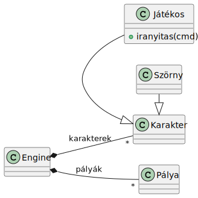

# Specifikáció segítség
Előadáson megoldott modell diagramjai, segítség a speicifkációhoz

## Követelmények
[Követelménytáblázat](01_req.md)

## Használati esetek

## Osztályidagram

## Állapotgépdiagram

